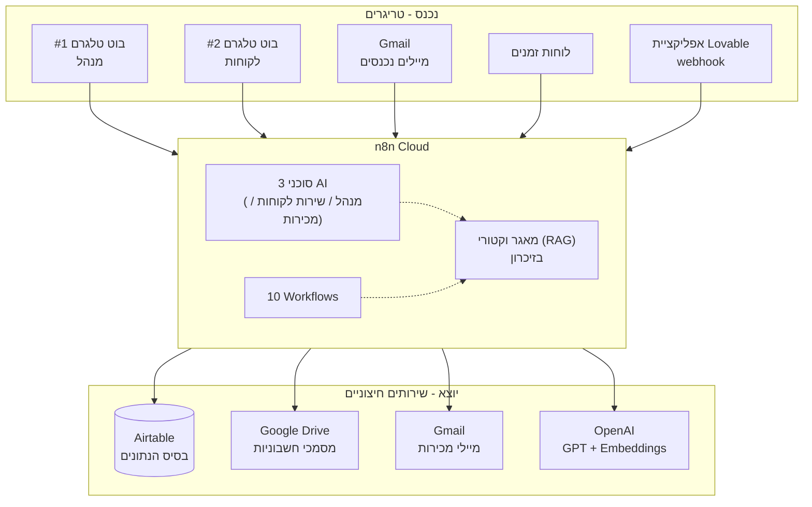
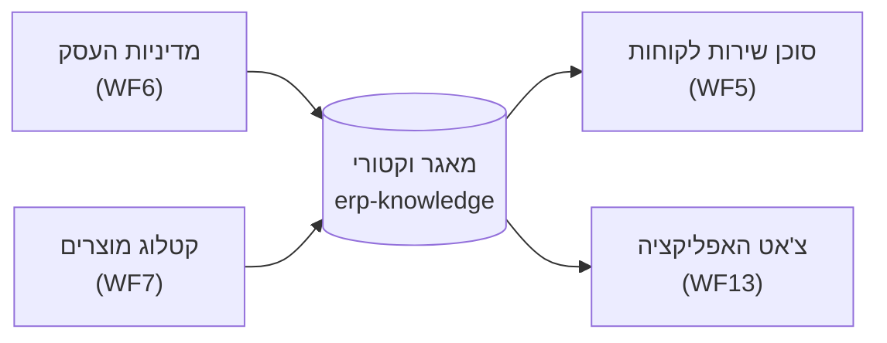

# AI-ERP עם n8n

פרויקט גמר בקורס מיישמי בינה מלאכותית ואוטומציה.

מערכת ERP קטנה לעסק אלקטרוניקה ישראלי דמיוני — סוכני AI, אוטומציה, ו-RAG, בנויים כולם ב-n8n, עם Airtable כמסד הנתונים ו-Lovable כשכבת הממשק.

כל ה-workflows נבנו ישירות ב-n8n Cloud, ונבדקו בפועל עם נתונים אמיתיים — כולל שליחת מיילים, הודעות טלגרם, והפקת חשבוניות.

## תוכן העניינים

- [ארכיטקטורה](#ארכיטקטורה)
- [שלוש השכבות](#שלוש-השכבות)
- [עשרת ה-Workflows](#עשרת-ה-workflows)
- [RAG — מאגר הידע הווקטורי](#rag--מאגר-הידע-הווקטורי)
- [סכימת הנתונים ב-Airtable](#סכימת-הנתונים-ב-airtable)
- [ה-Webhook לאפליקציה](#ה-webhook-לאפליקציה)
- [איך מריצים מאפס](#איך-מריצים-מאפס)
- [באגים שנמצאו ותוקנו תוך כדי בדיקה](#באגים-שנמצאו-ותוקנו-תוך-כדי-בדיקה)
- [מגבלות ידועות](#מגבלות-ידועות)

## ארכיטקטורה



## שלוש השכבות

| שכבה | היכן מיושמת | תפקיד |
|---|---|---|
| **נתונים** | Airtable | 4 טבלאות (Invoices, Leads, Products, Tasks) — מקור האמת לכל הרשומות |
| **לוגיקה ואוטומציה** | n8n Cloud | 10 workflows + 3 סוכני AI + מאגר וקטורי — כל מה שקורה "מעצמו" |
| **ממשק** | Lovable | אפליקציית ווב לניהול: דשבורד, טבלאות, טפסים, צ'אט עם הסוכן |

## עשרת ה-Workflows

כל workflow שמור גם כקובץ JSON לייבוא חוזר ב-[`n8n-workflows/`](n8n-workflows/).

| # | שם | טריגר | מה עושה | נבדק בפועל |
|---|-----|--------|---------|:---:|
| WF6 | [מדיניות → מאגר וקטורי](n8n-workflows/WF6-policy-vector-store.json) | ידני | טוען את מדיניות העסק (עברית), מפצל, ממיר ל-embeddings, ושומר במאגר הווקטורי המשותף | ✅ |
| WF7 | [מוצרים → מאגר וקטורי](n8n-workflows/WF7-products-vector-store.json) | ידני | קורא את כל המוצרים מ-Airtable ומוסיף אותם לאותו מאגר וקטורי | ✅ |
| WF5 | [סוכן שירות לקוחות](n8n-workflows/WF5-customer-service-agent.json) | בוט טלגרם (לקוחות) | סוכן AI עם זיכרון שיחה וכלי חיפוש ב-RAG, עונה ללקוחות בעברית בלבד | ✅ נבדק חי בטלגרם |
| WF9 | [סוכן המנהל](n8n-workflows/WF9-manager-agent.json) | בוט טלגרם (מנהל) | מוגבל ל-Chat ID של הבעלים בלבד; מסכם הכנסות/חשבוניות מ-Airtable ועונה בעברית | ✅ נבדק חי בטלגרם |
| WF1 | [אימות מסמכי מס + מע"מ](n8n-workflows/WF1-invoice-validation.json) | Airtable Trigger (Invoices) | מחשב מע"מ (18% מ-2025, אחרת 17%), נותן מספר חשבונית עוקב, מסמן "מוכן להפקה" | ✅ נבדק מקצה לקצה |
| WF8 | [הפקת חשבונית + דרייב](n8n-workflows/WF8-invoice-document-drive.json) | Schedule (כל דקה) | בונה HTML בעברית RTL, מעלה ל-Google Drive, מעדכן קישור וסטטוס | ✅ נבדק מקצה לקצה |
| WF2 | [קליטת ליד + סינון כפילויות](n8n-workflows/WF2-lead-intake-dedup.json) | Airtable Trigger (Leads) | סופר לידים קיימים עם אותו אימייל, מסמן "כפילות" או "חדש" | ✅ נבדק חי (3 לידי בדיקה) |
| WF3 | [סוכן מכירות — מיילים קרים](n8n-workflows/WF3-sales-cold-email.json) | Schedule (כל 3 שעות) | סוכן AI מנסח מייל קר לליד אחד, שולח ב-Gmail, מסמן "נוצר קשר" | ✅ נבדק חי — נשלח מייל אמיתי |
| WF4 | [סוכן מכירות — בדיקת תשובות](n8n-workflows/WF4-sales-reply-check.json) | Schedule (כל 30 דק', Gmail) | קורא תשובות מייל, מתאים לליד לפי כתובת השולח, מסווג עניין באמצעות AI | ✅ נבדק חי — תשובה אמיתית סווגה נכון |
| WF13 | [Webhook לאפליקציה](n8n-workflows/WF13-app-webhook.json) | Webhook (POST) | נקודת כניסה אחת ל-Lovable: `chat` (צ'אט RAG), `list` (קריאת טבלה), אחרת (יצירת רשומה) | ✅ נבדק — שלוש הפעולות |

## RAG — מאגר הידע הווקטורי



המאגר הווקטורי חי **בזיכרון** של n8n ולכן נמחק בכל הפעלה מחדש של השרת — יש להריץ שוב את WF6 ואז WF7 (בסדר הזה, כי WF6 מנקה ובונה מחדש) אחרי כל הפעלה מחדש.

## סכימת הנתונים ב-Airtable

| טבלה | שדות | הערות |
|---|---|---|
| `Invoices` | InvoiceNumber, CustomerId, Amount, VatAmount, Total, Status, PdfUrl, Created | `Created` מסוג **Created time**, `Status` טקסט רגיל |
| `Leads` | Name, Email, Company, Status, Created | `Created` מסוג **Created time**, `Status` טקסט רגיל |
| `Products` | Name, Category, Price, Description, InStock | |
| `Tasks` | Title, Status | `Status` טקסט רגיל |

## ה-Webhook לאפליקציה

נקודת קצה אחת (`WF13`) משרתת את כל התקשורת מהאפליקציה:

```
POST https://avielz.app.n8n.cloud/webhook/erp
```

| Action | Body | תשובה |
|---|---|---|
| קריאת טבלה | `{ "action": "list", "table": "Invoices" \| "Leads" \| "Products" \| "Tasks" }` | `{ "success": true, "records": [...] }` |
| יצירת רשומה | `{ "action": "create", "table": "...", "payload": { ... } }` | `{ "success": true, "id": "..." }` |
| צ'אט | `{ "action": "chat", "message": "...", "sessionId": "..." }` | `{ "reply": "..." }` |

⚠️ **הערת אבטחה:** ה-webhook הזה פתוח ללא אימות (`authentication: none`), כמו שהמדריך המקורי של הפרויקט ממליץ לצורך פשטות. כל מי שמכיר את הכתובת יכול לכתוב נתונים ל-Airtable. זה מקובל לפרויקט לימודי, אבל לא לסביבת ייצור אמיתית.

## איך מריצים מאפס

1. **חשבונות:** n8n Cloud, Airtable, OpenAI, שני בוטי טלגרם (BotFather), Google (Gmail + Drive).
2. **Airtable:** יוצרים בסיס עם 4 הטבלאות לפי הסכימה למעלה, ומעדכנים את ה-Base ID וה-Table IDs בכל קובצי ה-workflow (`n8n-workflows/*.json`) — או פשוט בונים מחדש ב-n8n ומחליפים את השדות `base`/`table` בכל צומת Airtable.
3. **Credentials ב-n8n:** מחברים Airtable, OpenAI, שני חשבונות Telegram, Gmail, Google Drive.
4. **מייבאים workflows:** ב-n8n → Workflows → Import from File, לכל אחד מהקבצים ב-`n8n-workflows/`. מעדכנים credentials בכל node.
5. **ממלאים את המאגר הווקטורי:** מריצים ידנית WF6 ואז WF7.
6. **מפעילים (Activate):** WF1, WF2, WF3, WF4, WF5, WF8, WF9, WF13.
7. **בונים את האפליקציה** ב-Lovable מול כתובת ה-webhook (ראו סעיף למעלה).

## באגים שנמצאו ותוקנו תוך כדי בדיקה

תיעוד למי שרוצה להבין את התהליך האמיתי של בניה ובדיקה, לא רק את התוצאה הסופית:

1. **WF7 — שדות ריקים:** צמתי Airtable מחזירים את השדות תחת `$json.fields.X`, לא `$json.X` ישירות. גרם לטקסט ריק בהוספה הראשונה למאגר הווקטורי. תוקן.
2. **WF2 — זיהוי כפילויות שגוי:** ה-IF בדק `$json.id` בעוד ששדה הפלט של Summarize נקרא בפועל `count_id`. גרם לזה שכפילויות סומנו כ-"חדש" בטעות. תוקן ואומת עם 3 לידי בדיקה.
3. **WF4 — התאמת ליד שגויה:** ה-Gmail Trigger תפס גם מיילים לא-קשורים (התראות) מהתיבה, וסינון לפי כתובת השולח לא עבד כראוי כשהיה משולב בתוך בניית הנוסחה. נפתר בצומת נפרד לחילוץ האימייל + הגבלת החיפוש ל-`category:primary` בלבד.

## מגבלות ידועות (בכוונה, לשם פשטות)

- המאגר הווקטורי וזיכרון השיחות יושבים בזיכרון בלבד — נמחקים בכל הפעלה מחדש של n8n.
- אין המרה אוטומטית ל-PDF — החשבונית נשמרת כ-HTML; המרה ל-PDF היא פעולה ידנית חד-פעמית בדרייב.
- מספור חשבוניות עלול "להתנגש" אם שני מסמכים נוצרים באותה דקה בדיוק.
- ה-webhook לאפליקציה פתוח ללא אימות.
- סוכן המנהל לא מקבל כלים ורואה עד 100 חשבוניות.

---

